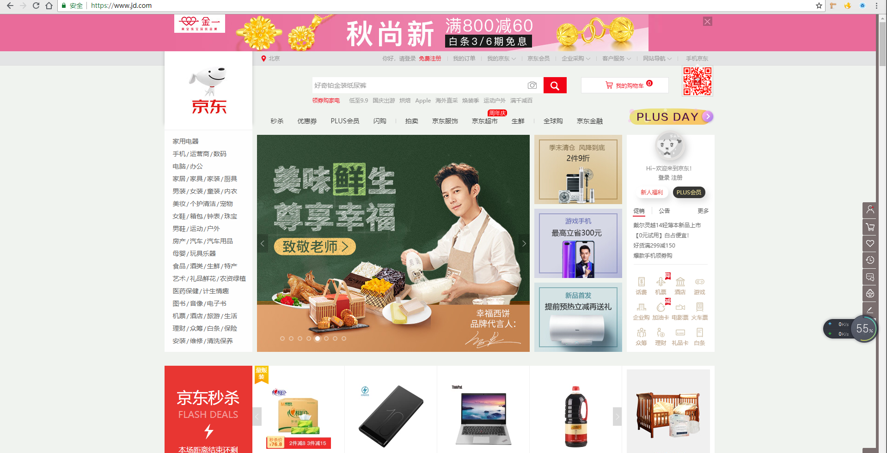
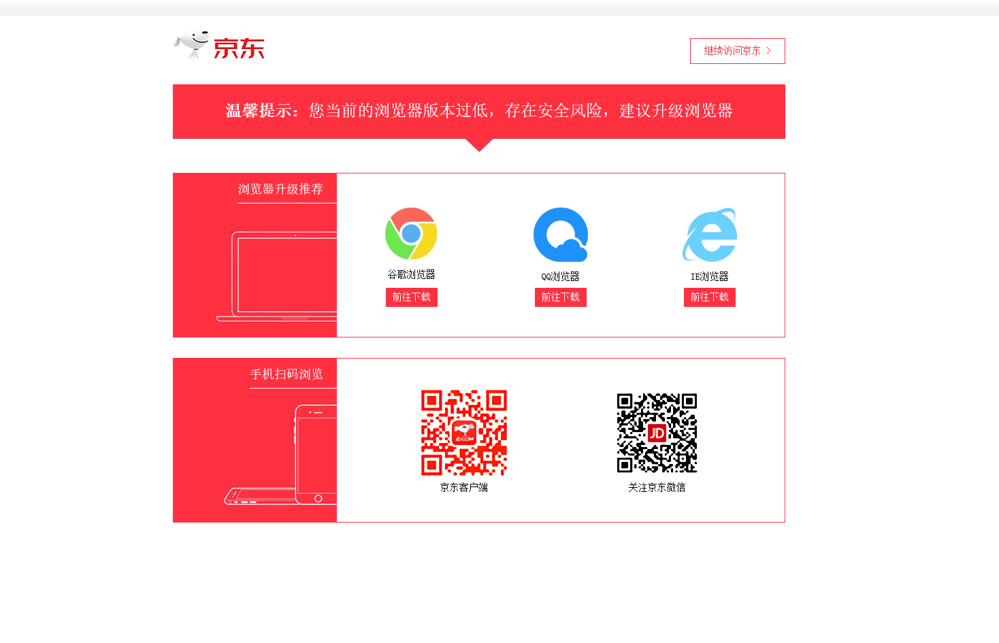
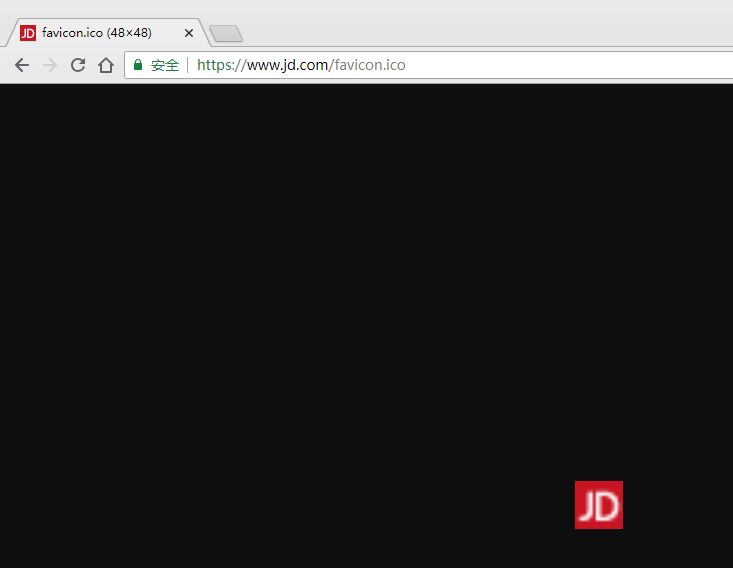
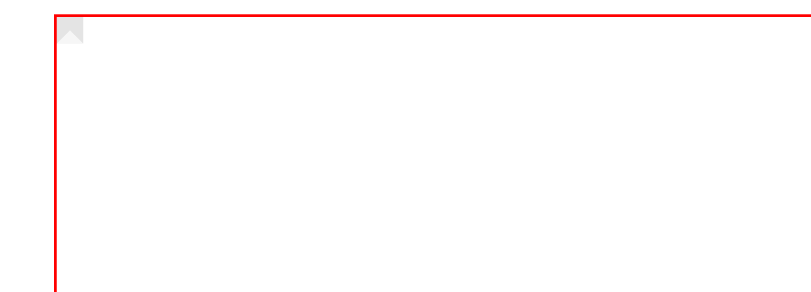
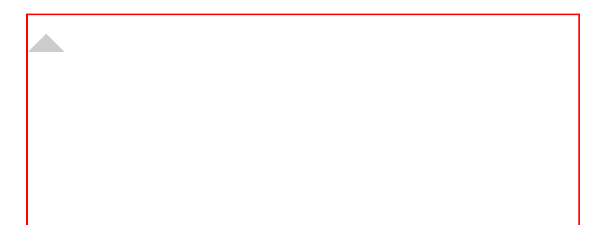

# 京东项目

## 1. 京东项目介绍

>项目名称：京东网
>
>项目描述：京东首页公共部分的头部和尾部制作，京东首页中间部分



## 2. 项目背景

​	现阶段电商类网站很流行，很多同学毕业之后会进入电商类企业工作，同时电商类网站需要的技术也是较为复杂的，这里用京东电商网站复习、总结、提高前面所学布局技术。

## 3. 设计目标

- 保证浏览器 ie 7 及以上，火狐，360，safari，chrome等。
- 熟悉 CSS+DIV 布局，页面的搭建工作
- 了解常用电商类网站的布局模式
- 为后期京东移动端做铺垫

## 4. 几点思考

- 开发工具：vs code、ps、各类浏览器
- CSS Reset 类库，为跨浏览器兼容做准备（也可以直接运行 jd 网站的初始化）

``` shell
normalize.css：
只是一个很小的 css 文件，但它在默认的 HTML 元素样式上提供了跨浏览器的高度一致性。相比于传统的 CSS reset，Normalize.css 是一种现代的、为 HTML5 准备的优质替代方案。Normalize.css 现在已经被用于 Twitter Bootstrap、HTML5 Boilerplate、GOV.UK、Rdio、CSS Triks 以及许许多多其他框架、工具和网站上。

- 保护有用的浏览器默认的样式而不是完全去掉它们
- 一般化的样式：为大部分 HTML 元素提供
- 修复浏览器自身的 bug 并保证各浏览器的一致性
- 优质 css 可用性：用一些小技巧
- 解释代码：用注解和详细的文档来
```

- 技术栈

``` shell
HTML 结构 + CSS 布局
```

- 低版本浏览器 单独制作一个跳转页面

https://h5.m.jd.com/dev/3dm8aE4LDBNMkDfcCaRxLnVQ7rqo/index.html



## 5. 目录说明

要实现结构和样式相分离的设计思想。根目录下有这 4 个文件（目录）

| 名称     | 说明                   |
| ------ | -------------------- |
| css    | 用于存放 CSS 文件          |
| images | 用于存放图片               |
| index  | 京东首页 HTML            |
| js     | 用于后期存放 JavaScript 文件 |

## 6. 运用知识点

### 6.1. 引入 ico 图标



``` html
代码：<link rel="shortcut icon" href="favicon.ico" type="image/x-icon">
```

注意：

1. 它不是 iconfont 字体，也不是图片
2. 位置是放在 head 标签中间
3. 后面的 type="image/x-icon" 属性可以省略
4. 为了兼容性，请将 favicon.ico 这个图标放到根目录下
5. 有时 favicon 在 chrome 中无法正常显示，可以通过 ctrl+f5 强制刷新就ok

### 6.2. 转换 ico 标签

图片转换为 ico 图标：http://www.bitbug.net

### 6.3. 网站优化三大标签

SEO 是由英文 Search Engine Optimization 缩写而来，中文意译为"搜索引擎优化"！SEO 是指通过对网站调整、网站内容建设、网站代码优化等）和站外优化，而提高网站的关键词排名以及公司产品的曝光度。好，搜素引擎就会介绍客户来。

我们在现在阶段主要进行站内优化。网站优化，我们应该要懂。

``` shell
|-- title
|-- description
|-- keyword
```

#### 6.3.1. 网站 title 标题

​	title 具有不可替代性，是我们的内页第一个重要标签，是搜素引擎了解网页的入口，和对网页主题归属

``` shell
|-- 标题的长度
	- Google（70KB），35个中文
    - Baidu（56KB），28个中文
|-- 关键字分布
	- 最先出现的词语权重越高
|-- 关键字词频
	- 主关键词出现3次
	- 辅关键词出现一次   
```

**建议：**

首页标题：网站名（产品名）- 网站的介绍

例如：

京东(JD.COM)-正品低价、品质保障、配送及时、轻松购物！

小米商城 - 小米8、小米MIX 2S、红米6 Pro、小米电视官方网站

#### 6.3.2. Description 网站说明

​	对于关键词的作用明显降低，但由于很多搜索引擎，仍然大量采用w网页的 meta 标签中描述部分作为搜索

要说明我们网站的主要做什么的。

我们提倡，Description 作为网站的总体业务和主题概况，多采用''我们是..."、"我们提供..."、"xxx网作为..."

京东网：

``` shell
<meta name="description" content="京东JD.COM-专业的综合网上购物商城,销售家电、数码通讯、电脑、家居百货、服装服饰、母婴、图书、食品等数万个品牌优质商品.便捷、诚信的服务，为您提供愉悦的网上购物体验!">
```

注意点：

1. 描述中出现关键词，与正文内容相关，这部分内容是给人看的，所以要写的很详细，让人感兴趣，
2. 同样遵循简短原则，字符数含空格在内不要超过 120 个汉字
3. 补充在 title 和 keywords 中未能充分表述的说明
4. 用英文逗号 关键词1，关键词2

``` shell
<meta name="description" content="小米商城直营小米公司旗下所有产品，囊括小米手机系列小米Note 3、小米8、小米MIX 2S，红米手机系列红米5 Plus、红米6 Pro，智能硬件，配件及小米生活周边，同时提供小米客户服务及售后支持。">
```

#### 6.3.3. Keywords 关键字

​	Keywords 是页面关键词，是搜素引擎关注点之一。keywords 应该限制在 6~8 个关键词左右，电商类网站

京东网：

``` shell
<meta name="Keywords" content="网上购物,网上商城,手机,笔记本,电脑,MP3,CD,VCD,DV,相机,数码,配件,手表,存储卡,京东">
```

小米：

``` shell
<meta name="keywords" content="小米,小米8,小米7,红米5Plus,小米MIX2,小米商城">
```

## 7. 开发遇到的 bug 总结

## 8. 一些列页面组件，我之前不会的

``` css
# 第一种写法
i {
  position: absolute;
  left: 0;
  top: 0;
  width: 0;
  height: 0;
  line-height: 0;
  font-size: 0;
  border-width: 5px;
  border-style: solid;
  border-color: #e4e4e4 #e4e4e4 #f6f6f6;
}

# 第二种写法
i {
  position: absolute;
  left: 0;
  top: 0;
  width: 0;
  height: 0;
  border-top: 10px solid transparent;
  border-left: 10px solid transparent;
  border-right: 10px solid transparent;
  border-bottom: 10px solid #ccc;
}
```





